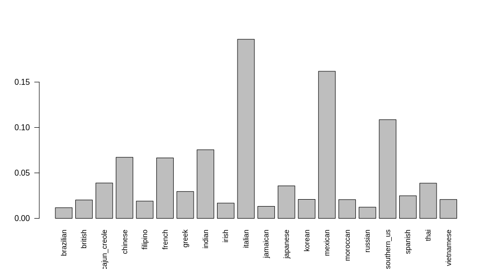

# Machine Learning - progetto

- Plot esplorativi sul dataset

  - Distribuzione ricette per tipo di cucina

    

    Spiegare perchè abbiamo ridotto le ricette italiane, messicane, etc... (perchè) e di quanto
    Ridotte fino a 2000 ricette per tipo di cucina e plottare anche quella roba lì

- 10-fold cross validation (controllare varianza per vedere se è un buon modello o meno)

  - Links:
    - https://www.analyticsvidhya.com/blog/2018/05/improve-model-performance-cross-validation-in-python-r/
    - http://topepo.github.io/caret/model-training-and-tuning.html
  - Fare plot e ROC per ogni fold e ogni classe

- ROC

  - https://towardsdatascience.com/understanding-auc-roc-curve-68b2303cc9c5
  - https://www.r-bloggers.com/calculating-auc-the-area-under-a-roc-curve/

- Feature selection

  - https://machinelearningmastery.com/feature-selection-with-the-caret-r-package/
  - 

# Data Technology 

- ingredients-dataset.json: creato dall'api food-database/parser
  - analizzare i dataset in base alle cose mancanti (mancano kcal, carbs, fat e proteins ad esempio)

- Descrizione delle modalità di scelta e acquisizione delle sorgenti dati e scelta del modello di descrizione del dataset
- Analisi di almeno 2 dimensioni di qualità e relative metriche dei dataset analizzati singolarmente
- Processo di integrazione dei dati ed eventuali problemi riscontrati includendo le eterogenità riscontrate
- Analisi di almeno 2 dimensioni di qualità e relative metriche delle features successivamente utilizzate
- Analisi descrittive dei dati integrati (a titolo di esempio nel dominio delle pubblicazioni scientifiche di docenti universitari possibili analisi sono
  - Numero di pubblicazioni per autore
  - Numero medio di autori per ogni pubblicazione
  - Grafo dei coautori